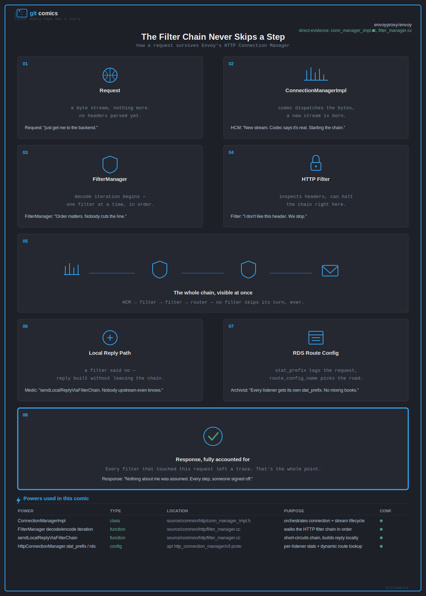

# GitComics

> Every repo has a story.

Turn any GitHub repository into an 8-panel comic strip. Shareable PNG. Interactive HTML. Grounded in real source code, not vibes.

## Example

**[→ View the interactive comic](https://shouvik12.github.io/gitcomics/examples/envoy_comic.html)**



*envoyproxy/envoy — "The Filter Chain Never Skips a Step." Every claim in this comic traces back to a real file: `conn_manager_impl.cc`, `filter_manager.cc`, and the HTTP connection manager proto.*

Each example ships as three files:

| File | What it's for |
|---|---|
| `examples/envoy_comic.png` | The shareable image — post it on X, Reddit, Slack, or embed it anywhere a normal image works. |
| `examples/envoy_comic.html` | The interactive version — [view it live](https://shouvik12.github.io/gitcomics/examples/envoy_comic.html), no download needed. Includes a clickable Powers table that links straight to the real source lines on GitHub. |
| `examples/envoy_comic.svg` | The canonical vector source both the PNG and HTML are generated from — edit this if you want to tweak colors, text, or panel layout by hand. |

The live version is served via [GitHub Pages](https://shouvik12.github.io/gitcomics/) — every HTML file in `examples/` is viewable the same way, at `https://shouvik12.github.io/gitcomics/examples/{filename}.html`.

## How to use

> **Requires a tool that can actually browse/fetch the repository.**
> GitComics' entire pipeline is `Repository → Evidence → Story → SVG`
> — step one is reading real files from GitHub. If the model or agent
> you paste `SKILL.md` into has no web/browsing tool enabled, it **cannot**
> gather real evidence, and it will silently fabricate plausible-sounding
> filenames and architecture instead — even while labeling them
> "Evidence: ..." or 🟢. This is not a hypothetical: it's a common failure
> mode we've seen firsthand when running the skill in tools without
> browsing enabled.
>
> Before trusting any output, confirm the tool actually fetched the repo.
> If unsure, ask it directly: *"Did you fetch [repo URL], or write this
> from the name alone? Do you have a tool that can browse GitHub?"*
> If it says no — don't trust the comic. Every filename and technical
> claim in it is likely invented, regardless of confidence labels shown.
>
> Confirmed to work: **claude.ai** (web search enabled by default),
> **Claude Code** (reads the actual local/cloned repo), any agent with a
> GitHub API/MCP connector. Not confirmed / known to fail silently:
> chat surfaces with no browsing tool enabled (e.g. some Gemini modes).

### Quickstart (claude.ai)

1. Copy [`SKILL.md`](./SKILL.md)
2. Open [claude.ai](https://claude.ai)
3. Paste `SKILL.md` as your first message
4. Say: `comic strip for github.com/[owner]/[repo]`
5. Claude generates your comic

### Claude Project (recommended for teams)

1. Create a new Project in claude.ai
2. Paste `SKILL.md` into Project Instructions
3. Every conversation in that project can generate comics
4. Share the project with your team

### Claude Code

```bash
cp SKILL.md ~/.claude/skills/gitcomics/SKILL.md
```

Then in any Claude Code session:

```
/gitcomics github.com/[owner]/[repo]
```

### API

```json
{
  "model": "claude-sonnet-4-6",
  "system": "[contents of SKILL.md]",
  "messages": [{ "role": "user", "content": "github.com/expressjs/express" }]
}
```
Returns SVG + HTML. Rasterize to PNG with Playwright/Chromium.

## What you get

- An 8-panel comic strip specific to **your** repo — not a generic architecture diagram
- Noir visual style, consistent GitComics branding
- Anti-slop guarantee: every comic must contain repo-specific details that break if you swap the filenames for another project's
- A Powers manifest at the bottom of every comic — every technical claim links back to a real function, class, endpoint, or config in the source
- Confidence scoring per claim (direct source evidence vs. inferred vs. docs-only)
- PNG for sharing (X, Reddit, GitHub)
- HTML for interactive viewing (click through to evidence)

## The pipeline

```
Repository → Evidence → Story → SVG → HTML + PNG
```

The SVG is the single canonical artifact. HTML wraps it. PNG rasterizes it. Neither HTML nor PNG independently redraws the comic — this keeps every output format honest to the same source of truth.

## Rules baked into the skill

**Evidence overrides story.** If the most entertaining version of a panel conflicts with what the source code actually does, the accurate version wins. A boring but true panel beats an exciting fictional one.

**Anti-slop rule.** Every comic must contain at least 2–3 repository-specific technical details. The test: swap all the filenames for another repo's. If the comic still makes sense, it's slop — rewrite it. If it breaks, it passes.

**Powers rule.** Every technical "power" shown in a panel must correspond to a real, identifiable artifact in the repo (a function, class, endpoint, command, or config value). If it can't be traced to source, it's marked conceptual — never presented as real.

**Powers manifest stays at the bottom.** Branding and the panel grid never compete with the powers table — it lives outside the 8-panel story grid, always last.

## License

MIT — see [LICENSE](./LICENSE).
